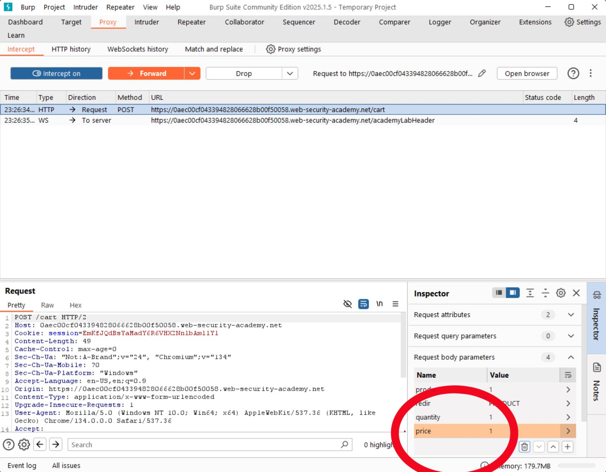

# Lab 1: Business Logic Vulnerability - Price Manipulation

**Author: Ismail Ibrahim**

## Objective

Exploit a business logic flaw to purchase an item for an unauthorized price by manipulating an intercepted HTTP request.

## Tool Used

Burp Suite - Proxy

## Steps

1. Configured Burp Proxy to intercept browser traffic
2. Added an item to the cart and intercepted the POST /cart request
3. Identified the price parameter in the request body
4. Modified the price value to near-zero before forwarding the request
5. Bypassed client-side validation - the server accepted the manipulated value

## Screenshot

## OWASP Reference

[A04 - Insecure Design](https://owasp.org/Top10/A04_2021-Insecure_Design/)

## Remediation

Price and quantity validation must be enforced server-side. Client-supplied values for sensitive parameters like price should never be trusted.