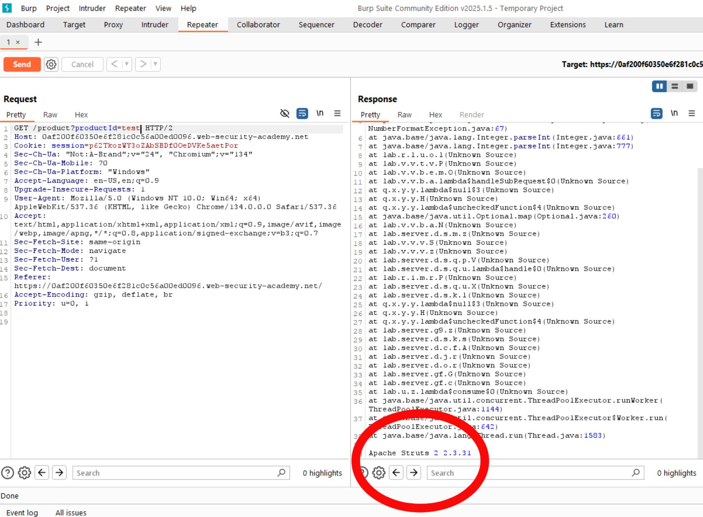

# Lab 2: Information Disclosure - Error Message Stack Trace

**Author: Ismail Ibrahim**

## Objective

Trigger a verbose error message that exposes backend framework information through a malformed HTTP request.

## Tool Used

Burp Suite - Repeater

## Steps

1. Captured a GET /product request using Burp Proxy
2. Forwarded the request to Burp Repeater
3. Injected a malformed parameter into the request
4. Server responded with a verbose stack trace
5. Stack trace revealed backend framework version: Apache Struts 2.3.31

## Screenshot

## OWASP Reference

[A05 - Security Misconfiguration](https://owasp.org/Top10/A05_2021-Security_Misconfiguration/)

## Remediation

Production environments should suppress verbose error messages. Generic error pages should be returned to users, with detailed logs kept server-side only.